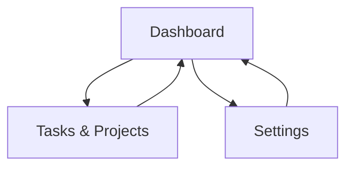

## 1. Product Overview
A desktop-first bento-box dashboard to monitor and control BOINC clients from a modern UI.
It helps you quickly see compute status, manage projects/tasks, and adjust connection/settings.

## 2. Core Features

### 2.1 User Roles
| Role | Registration Method | Core Permissions |
|------|---------------------|------------------|
| Local Operator | None (local app) | Can connect to a BOINC client and view/control status based on BOINC RPC access |

### 2.2 Feature Module
Our BOINC Manager requirements consist of the following main pages:
1. **Dashboard**: connection status, bento overview cards, quick actions, recent events.
2. **Tasks & Projects**: task list, project list, per-item controls, filters/sorting.
3. **Settings**: connect to host, store RPC password securely, UI preferences.

### 2.3 Page Details
| Page Name | Module Name | Feature description |
|-----------|-------------|------------------|
| Dashboard | Glass sidebar + navigation | Navigate between pages; show active connection target and status (connected/disconnected/error). |
| Dashboard | Bento overview | Show key BOINC metrics: overall state (running/suspended), CPU/GPU usage (if available), active tasks count, total credit/RAC (if available). |
| Dashboard | Quick actions | Trigger essential client controls: run/suspend, network on/off, refresh/update data. |
| Dashboard | Activity feed | Show recent client messages/events with timestamps and severity. |
| Tasks & Projects | Tasks list | List tasks with status/progress/ETA; support search and status filter; open task details drawer. |
| Tasks & Projects | Task controls | Suspend/resume/abort a task (when supported by RPC); show confirmation for destructive actions. |
| Tasks & Projects | Projects list | List attached projects with status, resource share (if available), last contact; open project details drawer. |
| Tasks & Projects | Project controls | Update/suspend/resume/no-new-tasks for a project (when supported by RPC). |
| Settings | Connection settings | Set host (localhost/remote), port, and RPC password; test connection; show errors clearly. |
| Settings | Secure storage | Store RPC password in OS keychain/secure storage; allow forgetting credentials. |
| Settings | UI preferences | Toggle theme (light/dark), reduce motion, sidebar compact mode. |

## 3. Core Process
**Connect & monitor flow:** You open the app → if not connected, you go to Settings → enter host/port/password → test & save → return to Dashboard to see bento status cards and activity.

**Manage tasks/projects flow:** You open Tasks & Projects → filter tasks/projects → open an item drawer for details → apply actions (suspend/resume/update/no-new-tasks) → see the updated state reflected in lists and Dashboard.

