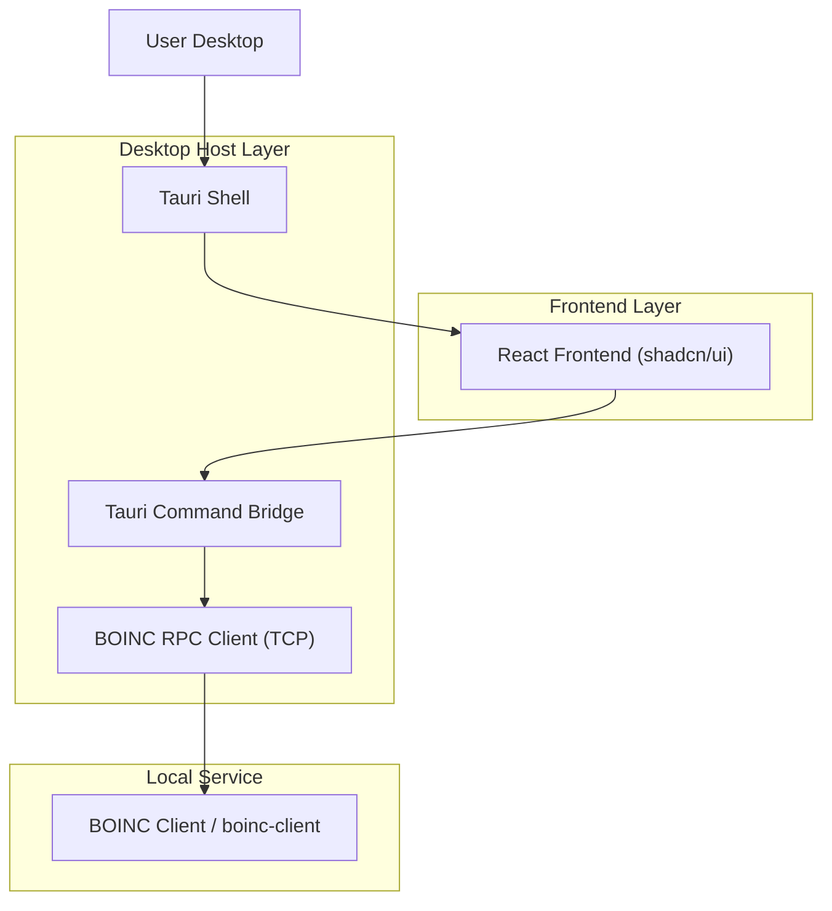
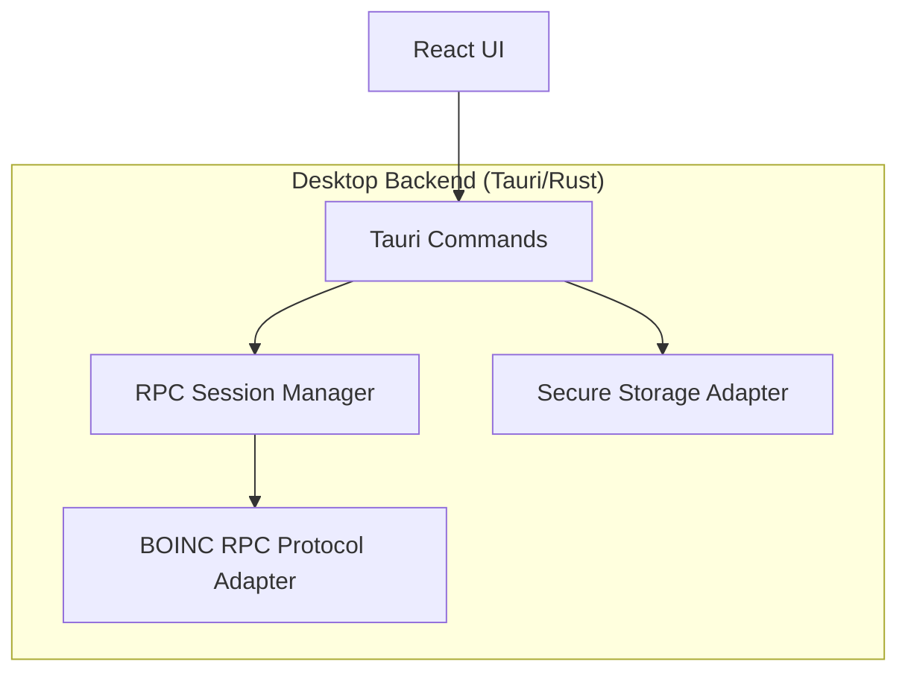

## 1.Architecture design


## 2.Technology Description
- Frontend: React@18 + TypeScript + vite + tailwindcss@3 + shadcn/ui + lucide-react + framer-motion
- Backend: Tauri (Rust commands for BOINC RPC + secure credential storage)

## 3.Route definitions
| Route | Purpose |
|-------|---------|
| / | Dashboard (bento overview + quick actions + activity feed) |
| /tasks | Tasks & Projects (lists + drawers + controls) |
| /settings | Settings (connection + security + UI preferences) |

## 4.API definitions (If it includes backend services)
### 4.1 Shared Types (TypeScript)
```ts
export type ConnectionTarget = {
  host: string; // e.g. "localhost" or LAN host
  port: number; // default 31416
};

export type ConnectionState =
  | { status: "disconnected" }
  | { status: "connecting"; target: ConnectionTarget }
  | { status: "connected"; target: ConnectionTarget }
  | { status: "error"; target?: ConnectionTarget; message: string };

export type BoincOverview = {
  overallState: "running" | "suspended";
  activeTaskCount: number;
  cpuUsagePct?: number;
  gpuUsagePct?: number;
  totalCredit?: number;
  rac?: number;
};

export type BoincTask = {
  id: string;
  name: string;
  projectName: string;
  state: "running" | "ready" | "suspended" | "paused" | "error" | "completed";
  progressPct: number;
  etaSeconds?: number;
};

export type BoincProject = {
  id: string;
  name: string;
  status: "active" | "suspended" | "no_new_tasks" | "error";
  resourceShare?: number;
  lastContactAt?: string; // ISO
};

export type BoincEvent = {
  id: string;
  level: "info" | "warning" | "error";
  message: string;
  createdAt: string; // ISO
};
```

### 4.2 Tauri Command Surface (concept)
- `connect(target, password)` → establishes RPC session
- `disconnect()`
- `get_overview()` → `BoincOverview`
- `list_tasks()` → `BoincTask[]`
- `list_projects()` → `BoincProject[]`
- `task_action(taskId, action)` where action ∈ suspend|resume|abort
- `project_action(projectId, action)` where action ∈ update|suspend|resume|no_new_tasks|allow_new_tasks
- `list_events()` → `BoincEvent[]`
- `secure_store_set(key, value)` / `secure_store_get(key)` / `secure_store_delete(key)` (implemented via OS keychain)

## 5.Server architecture diagram (If it includes backend services)


## 6.Data model(if applicable)
No application database is required. Configuration is stored locally (settings file) and secrets (RPC password) are stored in OS secure storage.
