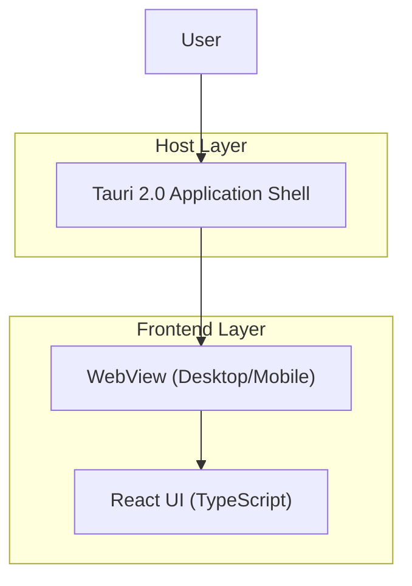

## 1.Architecture design

## 2.Technology Description
- Frontend: React@18 + TypeScript + vite + tailwindcss + shadcn/ui
- Backend: Tauri@2 (Rust host; no separate server)

## 3.Route definitions
| Route | Purpose |
|-------|---------|
| / | Single-screen UI that renders the Hello World view in Zinc dark theme |

## 6.Data model(if applicable)
Not applicable (no persisted data required for a Hello World screen).
